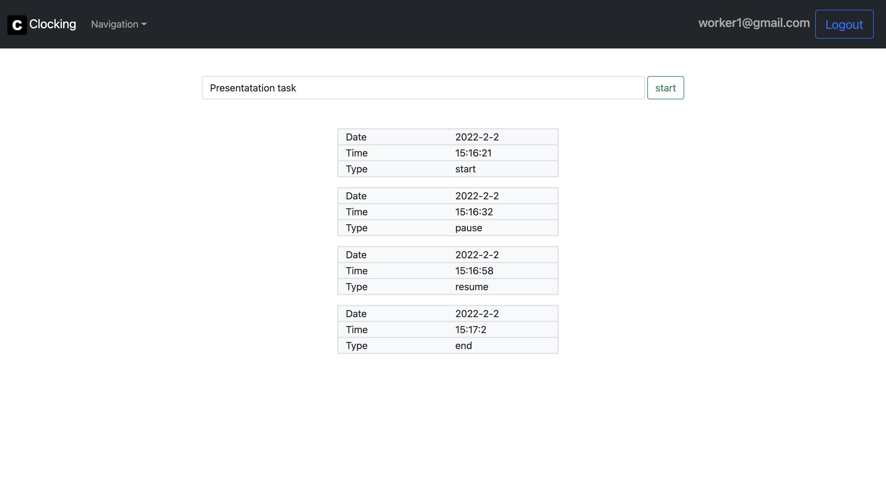
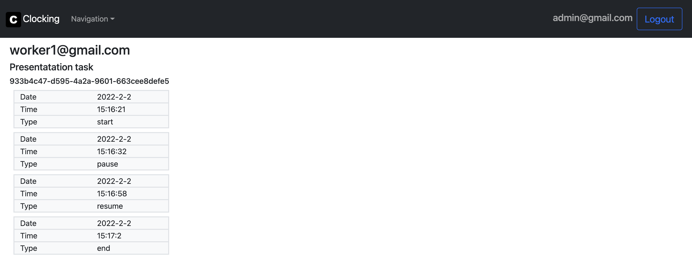

# clocking

APP FINISHED

APP FUNCTIONALITIES:

-   Singup / signin
-   Start / pause / resume / end task functionality
-   On worker side: showing all timestamps of current task
-   On admin side: displaying every task with task id, maker email, timestamp and descriptions
-   Worker can't start task when another task is in progress

## Tech/framework used 🔧

| Tech                                           | Description                               |
| ---------------------------------------------- | ----------------------------------------- |
| [Typescript](https://www.typescriptlang.org/)  | Javascript superset language              |
| [React](https://reactjs.org/)                  | Library for building user interfaces      |
| [Express](https://expressjs.com/)              | Backend web framework for Node.js         |
| [Jwt](https://jwt.io/)                         | Library for identifying user session      |
| [MongoDB](https://www.mongodb.com/)            | Non-relational database                   |
| [Eslint](https://eslint.org/)                  | Javascript Linter                         |
| [Prettier](https://prettier.io/)               | Code formatter                            |
| [Bcrypt](https://www.npmjs.com/package/bcrypt) | Package for crypting (hashing) data       |
| [Bootstrap](https://getbootstrap.com/)         | CSS library                               |
| [Axios](https://axios-http.com/docs/intro)     | Promise based HTTP client                 |
| [Redis](https://redis.io/)                     | In-memory data structure store (for chat) |

## Admin panel 👨 💻

login: admin@gmail.com
password: Password1$

## Photos 🏙

